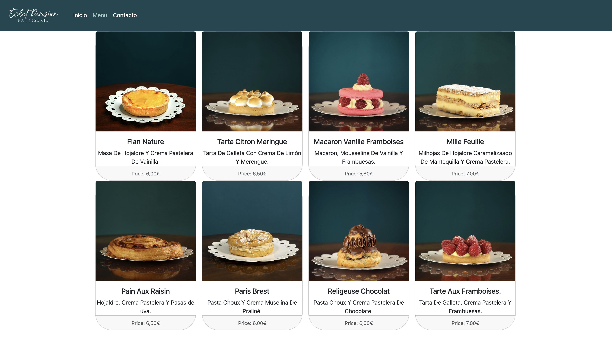
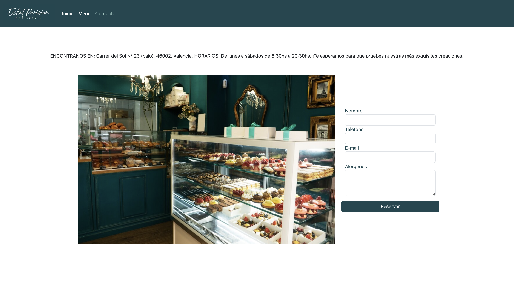
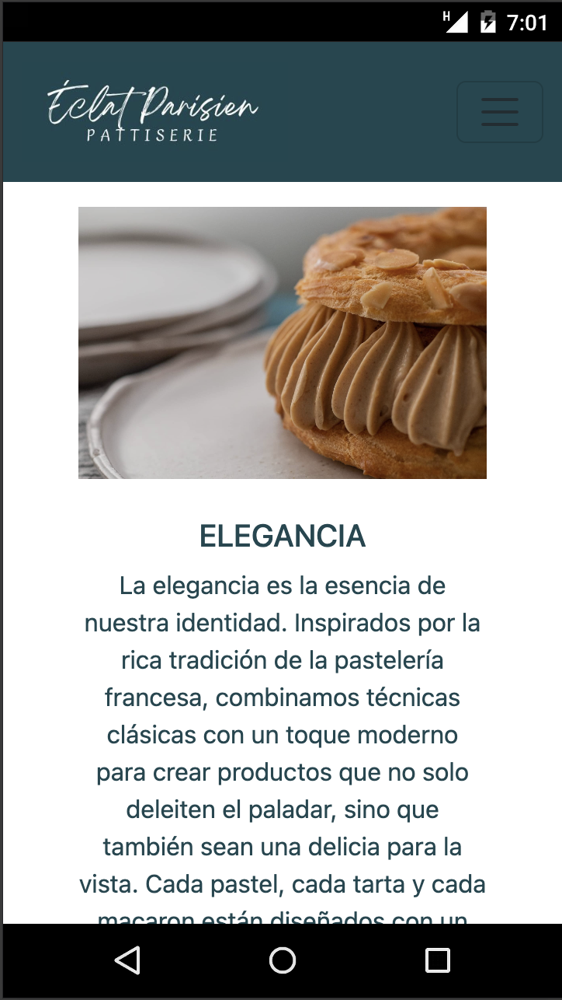

# 🍰 Éclat Parisien - Página Web de Alta Pastelería Francesa

## 📖 Descripción
**Éclat Parisien** es una pastelería francesa que ofrece productos de alta calidad y gourmet, presentados con una elegancia inigualable. Este proyecto web tiene como objetivo proporcionar una experiencia en línea que refleje la sofisticación y excelencia de la pastelería, permitiendo a los clientes explorar nuestros productos, realizar pedidos en línea y contactar con nosotros fácilmente.


## 🌟 Características
- **Página Principal:** Presentación de la pastelería, destacando nuestros valores.
- **Menu:** Presentación de nuestros productos gourmet.
- **Formulario de Contacto:** Espacio para que los clientes envíen consultas o pedidos especiales.


## 🔮 Futuras funcionalidades
- **Página Principal:** Apartado "Sobre Nosotros".
- **Menu:** Carrito de compras con opción para recoger o envío a domicilio.
- **Formulario de Contacto:** Link a Google Maps y Botón para acceder a Whatssap y otras RRSS. 


## 🛠️ Tecnologías Utilizadas
- **HTML5**: Estructura del sitio web.
- **CSS3**: Estilos y diseño visual.
- **Bootstrap**: Framework CSS para un diseño responsivo.
- **Git**: Control de versiones.


## 📸 Capturas de Pantalla

| Captura | Descripción |
|---------|-------------|
|  | **Página Principal:** Bienvenida a Éclat Parisien |
|  | **Productos:** Detalles de nuestras delicias |
|  | **Formulario de Contacto:** Consulta o pedido especial |
|  | **Vista Móvil:** Diseño responsivo en acción |


## 🚀 Deployment

https://more-pe.github.io/myWebPage/

## 🏗️ Instalación y Uso
1. **Clonar el repositorio:**
    ```sh
    git clone https://github.com/More-Pe/MyWebPage.git
    ```
2. **Navegar al directorio del proyecto:**
    ```sh
    cd eclat-parisien
    ```
3. **Abrir `index.html` en tu navegador preferido:**
    ```sh
    open index.html
    ```
## 🔖 Créditos
- **Página web inspiración**: [Copyright 2023 © Passageaparis.Es](https://passageaparis.es/)
- **Desarrollada por**: Maïro Frebourg
- **Fotografías por**: @julie_stor

## 🤝 Contribución
1. Haz un fork del proyecto.
2. Crea una nueva rama (`git checkout -b feature-nueva`).
3. Realiza tus cambios y haz un commit (`git commit -m 'Añadir nueva funcionalidad'`).
4. Sube tus cambios (`git push origin feature-nueva`).
5. Abre un Pull Request.


## 📞 Contacto
- **Correo Electrónico:** more.peralta.mp@gmail.com
- **LinkedIn:** [Morena Peralta Almada](https://www.linkedin.com/in/morena-peralta-almada/)